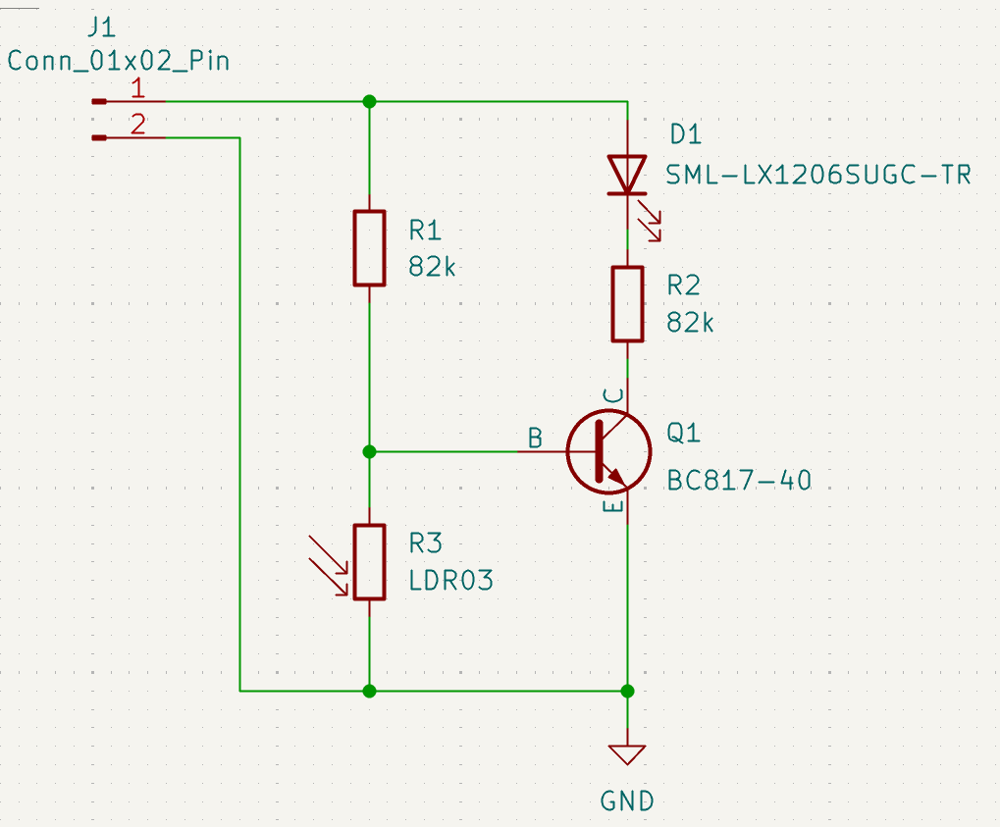
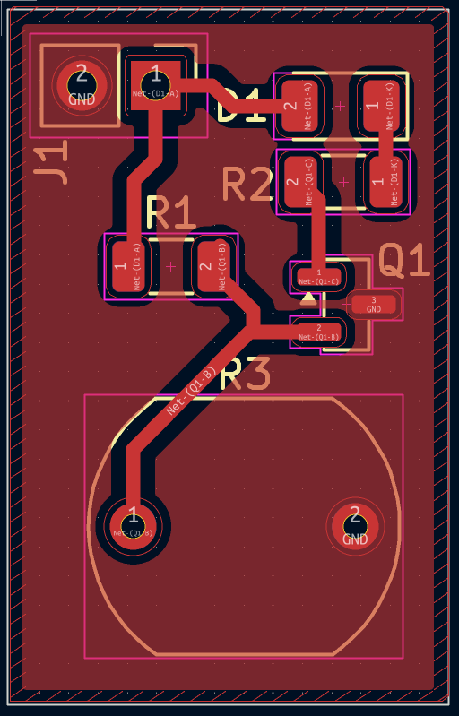
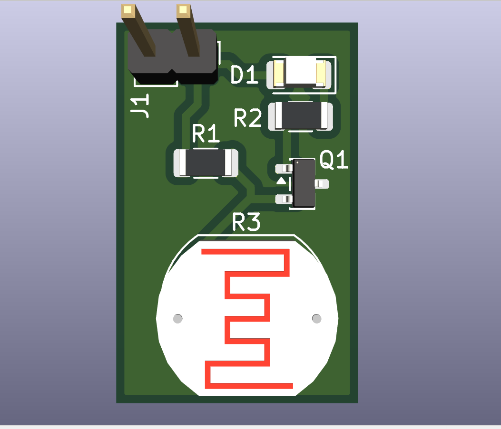

# 🌙 LDR Based Automatic Night Light System

**Internship Mini Project**

---

## 📋 Overview

The **LDR Based Automatic Night Light System** is a simple, energy-efficient automatic lighting controller. It uses a Light Dependent Resistor (LDR) to detect ambient light levels and automatically turns an LED ON during darkness and OFF during daylight.

This project demonstrates:
- Light sensing using LDR
- Transistor-based switching
- PCB design using KiCad
- Sustainable energy usage (aligns with SDG 7: Affordable and Clean Energy)

**Designed & simulated in KiCad**  
**Power Supply:** 5V DC

---

## ✨ Features

- Fully automatic operation (no manual switch needed)
- Low power consumption
- Cost-effective and easy to build
- Compact PCB design
- Real-world applications: street lights, garden lights, corridor lighting, security systems

---

## 🛠️ Components Used

| Sl. No | Component                  | Specification                  |
|--------|----------------------------|--------------------------------|
| 1      | Light Dependent Resistor   | LDR03 Photoresistor            |
| 2      | Transistor                 | BC817-40 (NPN)                 |
| 3      | LED                        | SML-LX1206SUGC-TR (Green)      |
| 4      | Resistor R1                | 82 kΩ                          |
| 5      | Resistor R2                | 82 kΩ                          |
| 6      | DC Power Connector         | 2-Pin connector (J1)           |
| 7      | Power Supply               | 5V DC                          |

**Note:** The schematic file (source of truth) shows R2 = 82 kΩ.

---

## 📐 Circuit Schematic

**Key Connections:**
- LDR (R3) + R1 form voltage divider for transistor base
- Q1 (BC817-40) acts as electronic switch
- R2 limits current through the LED

---

## 🖨️ PCB Layout

---

## 📦 3D View

---

## 🔬 How It Works

The system works on the principle of variation in resistance of the LDR with respect to light intensity.

- **Daytime (bright light):** LDR resistance drops sharply → voltage at transistor base becomes too low → transistor stays OFF → LED remains OFF.
- **Nighttime (low light):** LDR resistance increases significantly → sufficient base voltage turns the transistor ON → current flows through R2 and LED → LED glows automatically.

The transistor (BC817-40) acts as a simple electronic switch, and the whole circuit runs on 5V DC with zero standby power when the LED is off.

---

## 🚀 How to Build & Test

1. Use the provided KiCad schematic & layout (or recreate from images)
2. Fabricate the PCB
3. Solder components exactly as shown in the 3D view
4. Connect 5V DC supply to J1
5. Cover the LDR with your hand → LED should turn ON
6. Shine light on the LDR → LED should turn OFF

**Pro tip:** Test everything on a breadboard first before soldering!

---

## 🛡️ License

Open-source under the **MIT License**. Feel free to use, modify, and share!

---

**Made with ❤️ in Bengaluru**  
**Last updated:** March 2026
